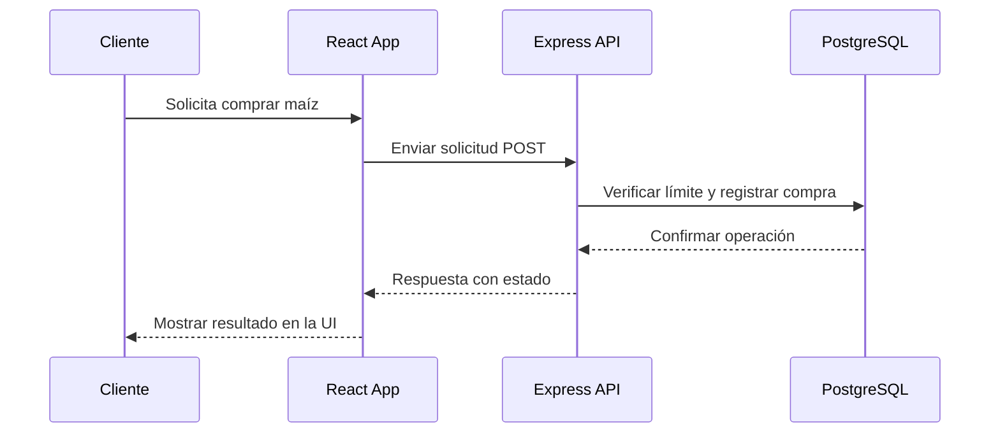

# 🌽 Bob's Corn Challenge

## Descripción

Bob's Corn es una aplicación full-stack que simula una tienda de maíz con un sistema de rate limiting. El proyecto implementa una política justa de venta: máximo 1 maíz por cliente por minuto.

## Arquitectura



## Tecnologías Utilizadas

### Frontend

- React 18
- TypeScript
- Vite
- Tailwind CSS
- Shadcn/ui
- Axios

### Backend

- Node.js
- Express
- TypeScript
- PostgreSQL
- Prisma ORM

## Características Principales

- ⏱️ Rate limiting: 1 maíz por minuto por cliente
- 📊 Contador de compras por cliente
- 🎨 Interfaz moderna con Shadcn
- 🔒 Sistema robusto de gestión de errores
- 📱 Diseño responsive

## Instalación

### Prerrequisitos

- Node.js >= 18
- PostgreSQL >= 14
- npm o yarn

### Pasos de Instalación

1. Clonar el repositorio

```bash
git clone https://github.com/LeoCodeDev/bobs-corn.git
cd bobs-corn
```

2. Instalar dependencias del backend

```bash
cd backend
npm install
cp .env.example .env
# Configurar variables de entorno
npx prisma migrate dev
npm run dev
```

3. Instalar dependencias del frontend

```bash
cd ../frontend
npm install
npm run dev
```

## Estructura del Proyecto

```
bobs-corn/
├── backend/         # Servidor Express
│   ├── src/        # Código fuente
│   └── prisma/     # Esquemas y migraciones
└── frontend/       # Aplicación React
    └── src/        # Código fuente
```

## Licencia

MIT
