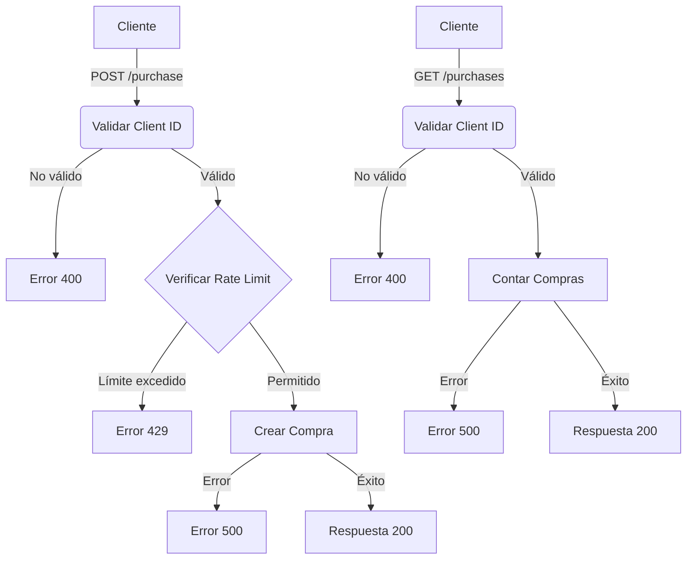

# Bob's Corn Backend

## Descripción

API REST para Bob's Corn, desarrollada con Express y TypeScript. Implementa un sistema de rate limiting basado en PostgreSQL para controlar las compras de maíz.

## Tecnologías Utilizadas

- Node.js
- Express
- TypeScript
- PostgreSQL
- Prisma ORM
- Docker (opcional)

## Flujo de Trabajo



## Estructura del Proyecto

```
src/
├── config/           # Configuraciones
├── controllers/      # Controladores
├── lib/             # Librerías y utilidades
├── routes/          # Rutas de la API
├── services/        # Lógica de negocio
├── types/           # Tipos TypeScript
└── app.ts           # Punto de entrada
```

## Instalación

1. Clonar el repositorio

```bash
git clone [url-repositorio]
cd bobs-corn-backend
```

2. Instalar dependencias

```bash
npm install
```

3. Configurar variables de entorno

```bash
cp .env.example .env
```

4. Configurar la base de datos

```bash
npx prisma migrate dev
```

5. Iniciar el servidor

```bash
npm run dev
```

## Scripts Disponibles

- `npm run dev`: Inicia el servidor en modo desarrollo
- `npm run build`: Construye la aplicación
- `npm start`: Inicia el servidor en producción

## Características

- 🚀 API RESTful
- 🔒 Rate limiting por cliente
- 📊 Persistencia en PostgreSQL
- 🔍 Logging de errores
- ⚡ Hot reload en desarrollo

## Rate Limiting

El sistema implementa un límite de 1 compra por minuto por cliente utilizando PostgreSQL como fuente de verdad. Esto garantiza:

- Precisión en el control de límites
- Persistencia de datos
- Escalabilidad horizontal
