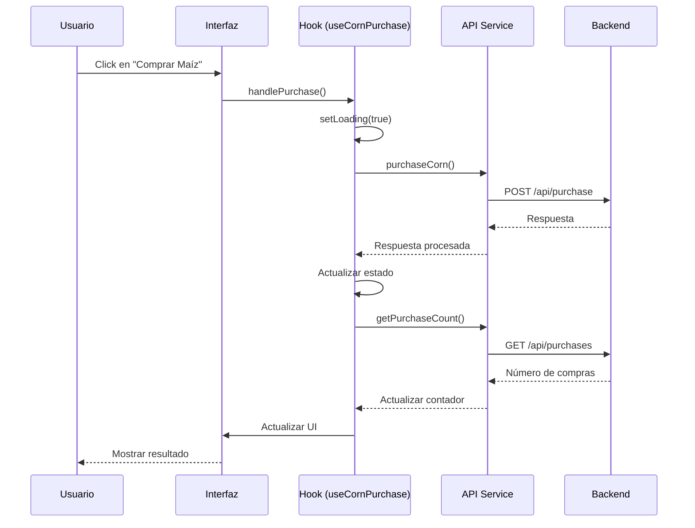

# Bob's Corn Frontend

## Descripción

Frontend de la aplicación Bob's Corn, desarrollada con React, TypeScript y Vite. Permite a los usuarios comprar maíz y ver su historial de compras.

## Tecnologías Utilizadas

- React 18
- TypeScript
- Vite
- Tailwind CSS
- Shadcn/ui
- Axios

## Flujo de Trabajo



## Estructura del Proyecto

```
src/
├── components/         # Componentes React
│   ├── ui/            # Componentes de UI (Shadcn)
│   └── corn/          # Componentes específicos
├── hooks/             # Custom hooks
├── services/          # Servicios API
├── types/             # Tipos TypeScript
└── utils/             # Utilidades
```

## Instalación

1. Instalar dependencias

```bash
npm install
```

2. Iniciar el servidor de desarrollo

```bash
npm run dev
```

## Scripts Disponibles

- `npm run dev`: Inicia el servidor de desarrollo
- `npm run build`: Construye la aplicación para producción
- `npm run preview`: Vista previa de la build de producción
- `npm run lint`: Ejecuta el linter

## Características

- 🌟 Interfaz moderna y responsive
- 🎨 Tema oscuro por defecto
- ⚡ Optimizado para rendimiento
- 🔒 Gestión de rate limiting
- 📊 Contador de compras en tiempo real
